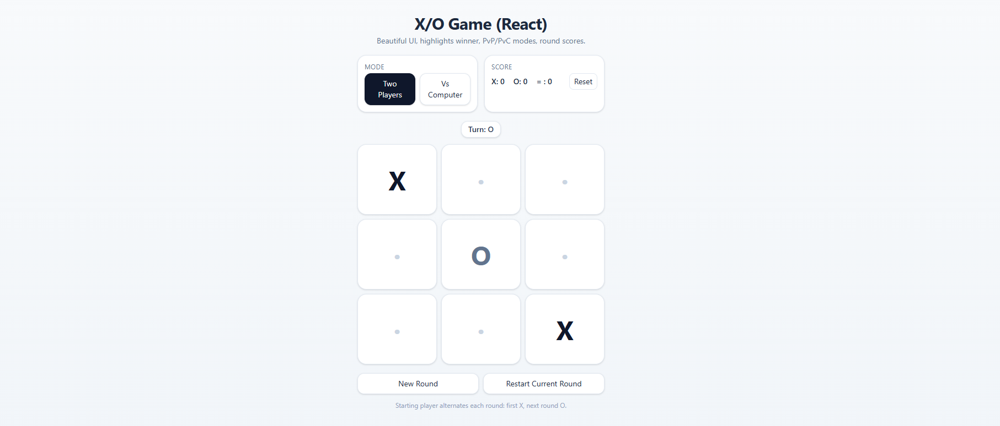

# React Tic-Tac-Toe (X/O Game)

A simple yet polished Tic-Tac-Toe game built with React and styled using Tailwind CSS. It supports both **Player vs Player (PvP)** and **Player vs Computer (PvC)** modes with a basic AI opponent.

## Features
- **Beautiful responsive UI** powered by Tailwind CSS
- **Two game modes**:
  - Player vs Player (local multiplayer)
  - Player vs Computer (AI bot)
- **AI logic** includes:
  - Immediate win detection
  - Blocking opponent's win
  - Center, corners, and sides strategy
- **Winner highlight** on the board
- **Round-based scoring** with automatic starting player alternation
- **Reset options**:
  - Reset the current round
  - Full game reset

## Installation
```bash
# Clone the repository
git clone https://github.com/yourusername/react-tic-tac-toe.git
cd tic-tac-toe

# Install dependencies
npm install

# Start the development server
npm start
```

## Usage
1. Open the game in your browser after running `npm start`.
2. Choose between **Two Players** or **Vs Computer** mode.
3. Play by clicking on the board cells.
4. Track the scores and start new rounds or reset the game anytime.

## File Structure
- `TicTacToe.jsx` – Main React component implementing the game logic and UI.
- Tailwind CSS is required for styling.

## Example Screenshot
**

## License
This project is licensed under the MIT License.
